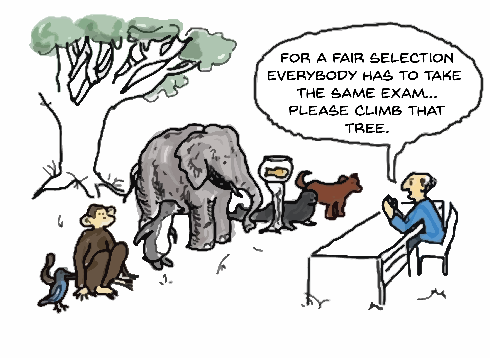

Open source communities often incorrectly assume that everyone is equally able to contribute. In reality, women and other groups are excluded, both intentionally and unintentionally, from open-source communities.

While women are already poorly represented in software development as a whole---only [22.1% of professional computer programmers are female](https://www.bls.gov/cps/cpsaat11.htm)---female representation in open-source is significantly worse. Less than [six percent of developers on GitHub are women](https://www.toptal.com/open-source/is-open-source-open-to-women), with the most active contributors being overwhelmingly male. Such an alarming lack of female representation highlights the existence of inherent bias and barriers that likely deter women from participating in open-source communities. This raises an important question: Does the current open-source ecosystem truly promote equal opportunities for all contributors, or does it simply perpetuate systemic inequalities?

One of the core values of the open source community is the idea of meritocracy---the idea that anyone can contribute and that their contributions will be judged on their merit, regardless of their background, gender, or other characteristics. Based on this principle alone, one might assume that the open-source community is accepting and diverse, allowing the best work to climb to the top regardless of who contributes it. However, the reality is that meritocracy is often used as a shield to defend the status quo, rather than a tool for promoting diversity and inclusion.

# What is Meritocracy?

<figure class="crop crop-4_3">

<figcaption>Image by <a href="https://insights.som.yale.edu/insights/how-meritocracy-worsens-inequality-and-makes-even-the-rich-miserable">Yale Insights</a></figcaption>
</figure>

[Meritocracy](https://www.merriam-webster.com/dictionary/meritocracy) is the idea that people should be rewarded based on their skills and abilities, rather than factors such as their race, gender, or socioeconomic status. In theory, this sounds like a fair and just system. In practice, it is far from it.

The problem with meritocracy is that it assumes that everyone has an equal starting point, which is simply not true. People are born into different circumstances and face different obstacles throughout their lives. This means that some people have more opportunities to develop their skills and abilities than others.

# The Myth of Meritocracy in Open Source

<blockquote class="mb-0">
  
Generally, at best, a meritocracy turns very quickly into a merit-and-confidence/pushiness-ocracy. Good work doesn’t win you influence, "good work that’s pushed in others' faces, or at the very least, good work of which others are regularly reminded" wins you influence. And that's where women fall down.

</blockquote>

— <a class="not-prose cursor-pointer" href="https://web.archive.org/web/20130204193633/http://blog.nerdchic.net/archives/134/" target="_blank" rel="nofollow noopener noreferrer">Noirin Shirley</a>

In open-source circles, the myth of meritocracy is particularly prevalent. The community prides itself on being meritocratic, with many going so far as to claim that ["patches don't have gender,"](https://journals.sagepub.com/doi/10.1177/1461444811422887) and that gender and other social differences should be ignored altogether in open-source circles. Despite its charming simplicity, this belief is not congruent with reality. Open source is not a level playing field, and even [the process of submitting patches](https://dl.acm.org/doi/10.1145/3180155.3180241) presents major, unequal challenges for contributors. Women, in particular, face numerous challenges that make it difficult to succeed in this environment.

## Gender Bias

One of the biggest challenges that women face in open source is gender bias. [Studies have shown](https://biancatrink.github.io/files/papers/TOSEM2021.pdf) that women are less likely to be accepted into open-source projects and that their contributions are often undervalued compared to those of their male counterparts. This bias can take many forms, from subtle microaggressions to [outright harassment](https://thenewstack.io/why-almost-everyone-wants-richard-stallman-cancelled/).

## Lack of Diversity

Another challenge that women face in open source is the lack of diversity. The community is still predominantly male, which can create an environment that is hostile to women. Women are less likely to feel welcome and included in open-source projects, which can discourage them from participating and contributing. Additionally, the challenge of finding mentors in a male-dominated community can make it difficult for women to gain a footing in open source groups or learn the [often over-complicated](https://dl.acm.org/doi/10.1145/3180155.3180241) processes required to contribute. This is a vicious cycle

# Meritocracy in Practice

<figure class="max-w-130 mx-auto">

</figure>

Even in cases where women do manage to overcome these challenges and make significant contributions to open-source projects, their work is often overlooked or undervalued. This is because meritocracy assumes that everyone has an equal opportunity to succeed, regardless of their background or circumstances. But the reality is that people who come from privileged backgrounds often have more opportunities to develop their skills and abilities, and are therefore more likely to be recognized and rewarded for their work.

## Moving Beyond Meritocracy

<blockquote class="mb-0">
  
Instead of chasing an unrealistic concept of meritocracy, we should be striving for equity. Rather than thinking, "everyone can contribute to open source", we should be thinking, "everyone deserves the opportunity to contribute".

</blockquote>

— <a class="not-prose cursor-pointer" href="https://dri.es/the-privilege-of-free-time-in-open-source" target="_blank" rel="nofollow noopener noreferrer">Dries Buytaert</a>

It's time to move beyond the myth of meritocracy and start addressing the systemic issues that prevent women from fully participating and succeeding in open-source development. This means creating a more welcoming and inclusive environment for women, addressing gender bias, and actively promoting diversity in the community. It also means recognizing and valuing the contributions of all members, regardless of their backgrounds or circumstances.

# Conclusion

The myth of meritocracy in open-source development is a pervasive and harmful belief that needs to be addressed. Women, in particular, face unique challenges that make it difficult to succeed in this environment. By recognizing and addressing these challenges, we can create a more inclusive and equitable community that values and rewards the contributions of all members, regardless of their background or circumstances. Here are some ways we can start:

- Educate ourselves and others about unconscious bias and its effects.

- Create and enforce codes of conduct that explicitly prohibit harassment and discrimination.

- Encourage and support mentorship programs for women.

- Work to make open source development more accessible to underrepresented groups.

- Celebrate the contributions of women and other underrepresented groups in open source development and work to promote their visibility.

As open-source developers, we all have a responsibility to make the community more welcoming and inclusive for everyone. This means we need to overcome the meritocracy myth and make conscious efforts to improve our communities and actively encourage women and other underrepresented groups to get involved.
