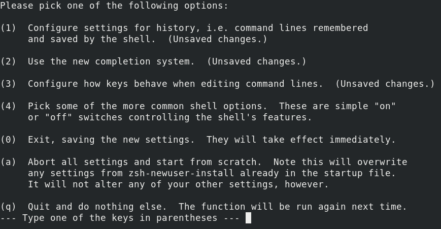

Fedora Silverblue is one of the most interesting Linux distros I have tried to date, and I ended up choosing to use it as my daily-driver for its stability, ease of updates, and cleanliness. However, one of my biggest must-haves was a proper, customized shell.

My personal choice of shell is ZSH with the [Zim Framework](https://github.com/zimfw/zimfw), giving me a fast and simple shell experience without too much hassle. However, the basic installation steps for these differ a bit on Fedora Silverblue.

## Installation

First, install `zsh` as a layered package on the host system with rpm-ostree:

```bash
sudo rpm-ostree install zsh
```

After doing so, go ahead and reboot to enter the new ostree deployment, which will now contain zsh.

Next, we'll go ahead and install zsh in toolbox. Enter the toolbox with `toolbox enter` and then install `zsh` the old fashioned way:

```bash
sudo dnf install zsh
```

Now that we've got zsh installed everywhere, type `exit` to get back to the host system. Since `chsh` is not included on Silverblue, we'll use `usermod` instead to switch to our shiny new shell:

```bash
sudo usermod --shell $(which zsh) $USER
```

Alternatively, Fedora offers `lchsh` which provides a similar interface to `chsh` on other Linux systems.

Start a new shell and you should be greeted by the ZSH first time configuration, which will look something like this:

If you've made it here, congratulations! Zsh is now installed and working.

## Customization

Silverblue's default bash shell contains some important tweaks which, for example, provide the purple indicator present when inside the toolbox. These tweaks are a must-have for me, so I'll be implementing them in my prompt theme for zsh. First, though, I'll install my zsh framework of choice, Zim:

```bash
curl -fsSL https://raw.githubusercontent.com/zimfw/install/master/install.zsh | zsh
```

These next steps may differ a bit depending on the framework you choose, but the principles are the same. Currently, there is no way of knowing whether or not the shell is running inside toolbox, so we'll start by fixing that.

The default Silverblue bash config uses a function that looks something like this to return whether or not toolbox is active:

```shell
if [ -f /run/.containerenv ] \
    && [ -f /run/.toolboxenv ]; then
    PS1=$(printf "\[\033[35m\]⬢\[\033[0m\]%s" "[\u@\h \W]\\$ ")
```

In other words, the presence of /run/.containerenv and /run/.toolboxenv is what indicates that the shell is running inside toolbox. We can use this in our zsh config to append the purple ⬢ symbol, albeit a bit more elegantly.

I took my prompt theme of choice, gitster, and duplicated its folder in ~/.zim/modules (this process will be similar for oh-my-zsh and others). I then edited my new prompt theme and added a function to detect the toolbox:

```shell
_prompt_toolbox() {
    if [ -f /run/.containerenv ] && [ -f /run/.toolboxenv ]; then
    print -n "%F{magenta}⬢ "
    fi
}
```

This function uses the same detection logic as the bash version, and uses the much more elegant `%F{}` zsh color syntax to switch the color to magenta before outputting the ⬢ character. Next, when the prompt variable, PS1, is defined at the end of the theme file, I added a call to `_prompt_toolbox()` at the beginning, resulting in the proper output of the indicator if and only if toolbox is active.

```shell
PS1='$(_prompt_toolbox)%(?:%F{green}:%F{red})➜ $(_prompt_gitster_pwd)${(e)git_info[prompt]}%f '
```

Now, time to test it out! I saved my new custom theme and enabled it in `~/.zimrc`. After running `zim compile` to build my new theme, I restarted zsh and was greeted with the same prompt as before. This time, though, entering the toolbox presented that small, purple indicator; finally giving me the beauty of a custom shell combined with the helpful utility that Silverblue's default configuration provides.
